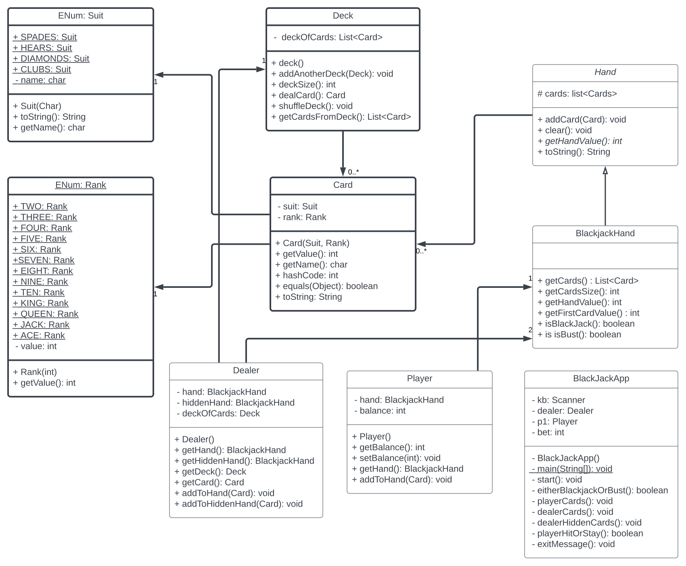

# BlackjackProject

## Description

This is a black jack game, upon starting the app the deck is shuffled. User is asked to place their bet. Player is started with a balance of $2,500. You can bet any amount or enter "quit" in this menu to stop the game. 

The dealer then deals two cards to each player. One to you the player, then other to themselves. You are then displayed with your two cards and card total, and one of the dealers cards card and its value. You can choose to hit or stay. Hit gives another card, if you go over 21 dealer automatically wins the hand. Once stay is selected the dealer either displays their card or hits if both of their cards values are under 17. If dealer goes over 21 they automatically loose as well. Winner is displayed based on highest hand. The user looses their bet if the dealers hand beats theirs. 

Game will continue till the user selects to quit the game or they run out of money. A custom exit message is displayed based upon how much money the user leaves the game with.  

## Technologies Used

- Eclipse IDE
- Git
- Java
	* Version: 1.8
	
This program utilizes OOP to simulate playing blackjack while using reusable objects such as playing cards, a deck of playing cards, and a hand of cards. The playing cards are are created with the use of enums for rank an suit.   

## What I learned 

This project taught me how to properly make use of my objects with a has-a relationship. I was trying to add a deck into the application class rather than the dealer having a deck. This helped me learn how to properly access the objects within another object with getters and setters. I was also easily able to add three decks to the "dealer deck", allowing to play black jack more casino style with 152 cards instead of 52.

I also got some good practice in with StringBuilder and loop logic getting the cards in each deck to print side by side. My cards printed fine but when the 10, card was printed it would throw the spacing off from the extra digit. I was able to get past this by modifying the toString for cards to check if the cards enum type was "TEN", if it was, no space was added. Otherwise ever other enum type returned a space at the end of it.

## UML

